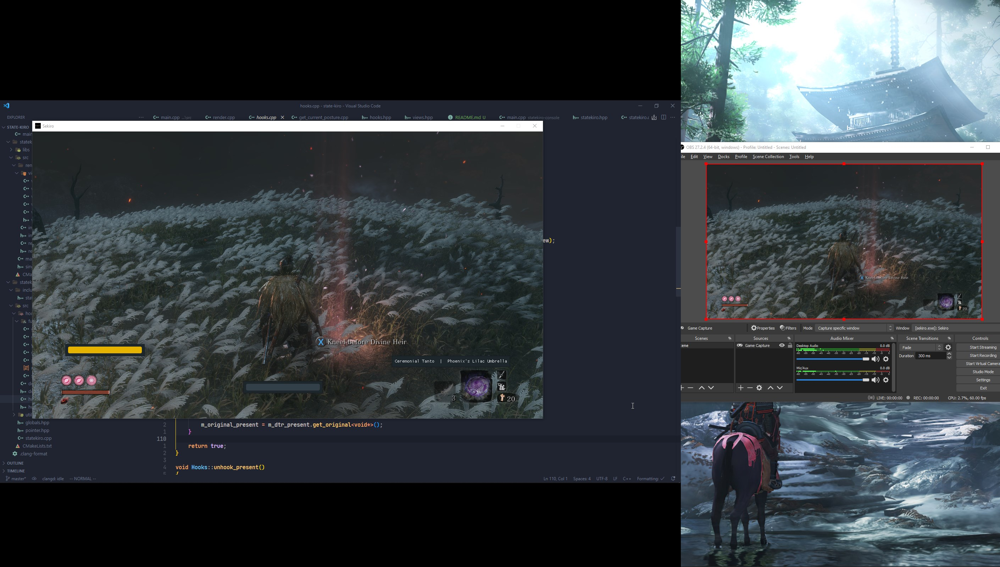

# Statekiro

Stream proof state indicator for [Sekiro™: Shadows Die Twice](https://store.steampowered.com/app/814380/Sekiro_Shadows_Die_Twice__GOTY_Edition)

Have you ever wanted to record your gameplay exploring areas like Fountainhead Palace or just beating bosses but the HUD of your health bar and stuff are kind of in the way? Disabling these HUDs means losing quite a bit of information from your screen, like your current health or your current prosthetic, etc.

Well, fear not, I've got just the thing for you, this mod will display your current health bar, posture bar, prosthetic and quick item, (more stuff are planned) which won't get picked up by your recording software.

# Screenshots


On the left is what you'll see (the yellow thingy, the one in the middle, and the one above your current prosthetic) and on the right is what OBS will see, none of those are picked up by the OBS


# Usage

- Start Discord (Optional, if you don't start Discord and enable game overlay OBS will see the same thing you see on screen)
- Start Sekiro
- Run the loader
- Start OBS

# Compiling

## Deps

- CMake
- C++20 Compiler

## With the provide build script

Only if your shell is POSIX compliant.

```
git clone --depth 1 https://github.com/ibldzn/state-kiro.git && \
cd state-kiro && \
./build --rel
```

## Manually Invoking CMake

```
git clone --depth 1 https://github.com/ibldzn/state-kiro.git && \
cd state-kiro && \
cmake -S . -B _build -DCMAKE_BUILD_TYPE=Release && \
cmake --build _build --config Release --parallel
```
